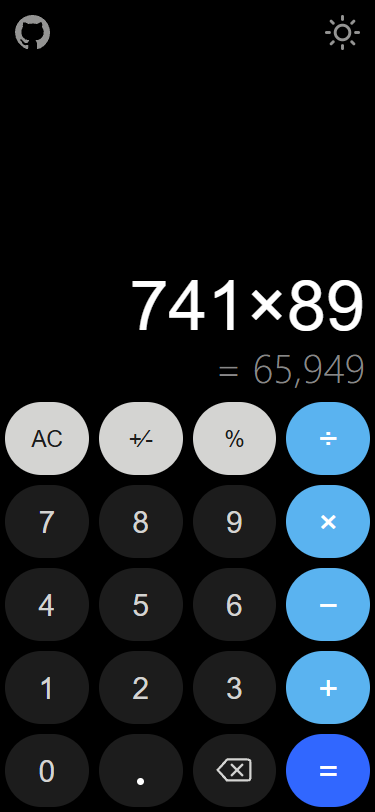
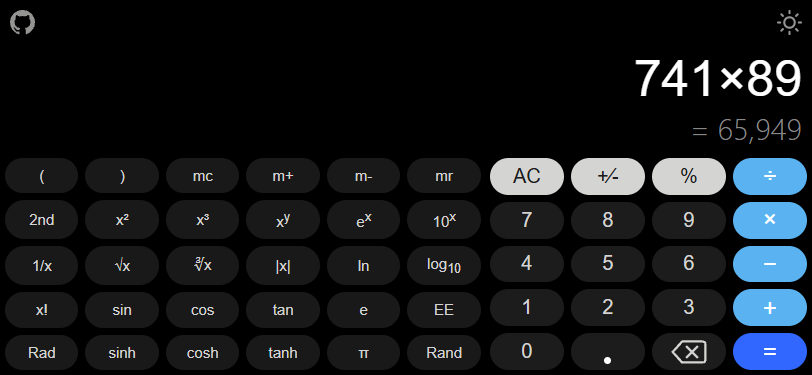
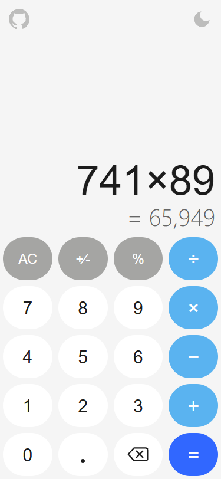
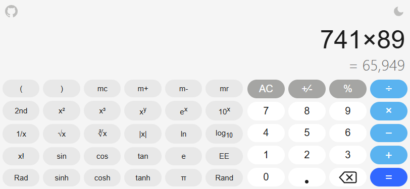

# JustCalculator

A simple, elegant calculator inspired by the Google Android Calculator. Built with pure HTML, CSS, and JavaScript — no frameworks, no dependencies.

Wraps into an Android app via WebView for native-like mobile experience.

## Screenshots

### Dark Theme
| Portrait | Landscape |
|----------|-----------|
|  |  |

### Light Theme
| Portrait | Landscape |
|----------|-----------|
|  |  |

## Features

- **Dark & Light themes** — toggle between dark and light modes with a smooth 0.5s transition; sun icon switches to light, moon icon switches back to dark
- **Responsive design** — adapts seamlessly to any screen size, from small phones to large desktop windows
- **Portrait & landscape modes** — landscape reveals an extended scientific calculator panel with trigonometric, logarithmic, and power functions
- **Live preview** — shows the intermediate result in real time as you type, just like Google Calculator
- **Auto-scaling display** — font size automatically adjusts to fit long expressions and large numbers
- **Comma-separated numbers** — large numbers are formatted with commas for readability (e.g. `65,949`)
- **Operator symbols** — displays proper mathematical symbols: `×` for multiplication, `÷` for division, `−` for minus
- **Input validation** — prevents invalid input sequences (double operators, repeated functions, etc.)
- **Auto-copy** — result is automatically copied to clipboard when you press `=`
- **Smooth animations** — button press scale effect and display text fade transitions (0.1s ease-in-out)
- **Backspace button** — custom SVG delete icon for correcting input
- **Scientific functions** — sin, cos, tan, sinh, cosh, tanh, ln, log10, sqrt, cbrt, abs, factorial, powers, and more
- **GitHub link** — quick access to the project repository from within the calculator

## Tech Stack

- **HTML5** — semantic markup, `readonly` input for selectable display
- **CSS3** — Flexbox & Grid layout, `min()` for responsive font sizes, `100dvh` for mobile Safari, media queries for all breakpoints, class-based theming with CSS transitions
- **Vanilla JavaScript** — no libraries, no build tools
- **Android (WebView)** — Kotlin wrapper for native Android app (Android 11+), external links open in default browser

## Project Structure

```
JustCalculator/
├── html-src/               # Web source files
│   ├── index.html
│   ├── favicon.ico
│   └── src/
│       ├── css/
│       │   └── styles.css
│       └── js/
│           ├── script.js   # Calculator logic, theme toggle & UI
│           └── math.js     # Math helper functions
├── android-src/            # Android Studio project
│   ├── app/
│   │   └── src/main/
│   │       ├── assets/     # Web files (copied from html-src)
│   │       ├── java/com/avlasov/justcalculator/
│   │       │   └── MainActivity.kt
│   │       └── res/
│   └── build.gradle.kts
└── screenshots/
    ├── portrait.png
    ├── portrait-light.png
    ├── landscape.png
    └── landscape-light.png
```

## Getting Started

### Web (Browser)

Serve the `html-src` directory with any static HTTP server:

```bash
cd html-src
npx http-server -c-1
```

Open `http://localhost:8080` in your browser.

### Android

1. Open the `android-src` folder in **Android Studio Otter** (or newer)
2. Sync Gradle
3. Run on a device or emulator with **Android 11+**

## Requirements

- **Web**: Any modern browser (Chrome, Firefox, Safari, Edge)
- **Android**: Android 11 (API 30) or higher

## Author

**Alexey Vlasov** — [GitHub](https://github.com/VlasovAlexey)

## License

Copyright (c) 2026 Alexey Vlasov. All rights reserved.

This software and associated documentation files (the "Software") are the exclusive property of Alexey Vlasov. No part of this Software may be reproduced, distributed, modified, or transmitted in any form or by any means without the prior written permission of the author.

**License type: Proprietary / All Rights Reserved**
